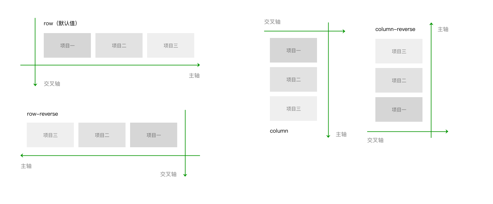

# 布局

Flex 布局

如果小程序要求兼容到iOS8以下版本，需要开启样式自动补全。开启样式自动补全，在“设置”—“项目设置”—勾选“上传代码时样式自动补全”


### 基本概念

flex的概念最早在2009年被提，目的是提供一种更加灵活的布局模型，使容器能够通过改变里面项目的高宽，顺序，来对可用空间实现最佳的填充，方便适配不同大小的内容区域。

在不固定高度信息的例子中，只需要在容器中设置以下两个属性即可实现内容不确定下的垂直居中

```text
.container{
display: flex;
flex-direction: column;
justify-content: center;
}
```

flex不单是一个属性，他包含了一套属性集。属性集包括用于设置容器，和用于设置项目两部分

设置容器的属性有

```text
display : flex
flex-direction :row(默认值) | row-reverse | column | column-reverse
flex-wrap:nowrap(默认值) | wrap | wrap-reverse
justify-content: flex-start(默认值) | flex-end | center | space-between | space-around | space-evenly
align-items:stretch(默认值) | center | flex-end | baseline | flex-start
align-content: stretch(默认值) | flex-start | center | flex-end | space-between | space-around | space-enevly
```

设置项目的属性有：

```text
order:0 (define) | <integer>
flex-shrink:1 (define) | <number>
flex-grow: 0 | <number>
flex-basis: auto | length
flex: none | auto | @flex-grow @flex-shrink @flex-basis
align-self: auto | flex-start | flex-end | center | baseline | stretch
```

在开始介绍各个属性之前，我们要先明确一个坐标轴。默认的情况下，水平方向是主轴，垂直方向是交叉轴


项目是在主轴上排列，排满后在交叉轴方向换行。需要注意的是，交叉轴垂直于主轴，它的方向取决于主轴方向


接下来的例子如无特殊声明，我们都以默认情况下的坐标轴为例

#### 属性容器

设置容器，用于统一管理容器内项目布局，也就是管理项目的排列方式和对齐方式

flex-direction 属性

> 通过设置坐标轴，来设置项目的排列方向

| 属性 | 含义 |
| :--- | :--- |
| row | 主轴横向，方向为从左指向右。项目沿主轴排列，从左到右排列 |
| row-reverse | row的反方向，方向为从右指向左。项目沿主轴排列，从右到左排列 |
| column | 主轴纵向，方向从上指到下。项目沿主轴排列，从上到下排列 |
| column-reverse | column的反方向。主轴纵向，方向从下指向上。项目沿主轴排列，从下向上排列 |



